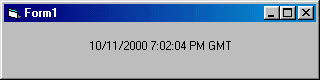



## Set System clock automatically from Internet

### Description

This is a simple little app to show you how to get the current time (GMT) from the Internet and automatically set your PC clock.
 
### More Info
 

             |
---                |---
**Submitted On**   |2000-10-11 14:58:24
**By**             |[Paul Mather](https://github.com/Planet-Source-Code/PSCIndex/blob/master/ByAuthor/paul-mather.md)
**Level**          |Beginner
**User Rating**    |4.5 (18 globes from 4 users)
**Compatibility**  |VB 5\.0, VB 6\.0
**Category**       |[Miscellaneous](https://github.com/Planet-Source-Code/PSCIndex/blob/master/ByCategory/miscellaneous__1-1.md)
**World**          |[Visual Basic](https://github.com/Planet-Source-Code/PSCIndex/blob/master/ByWorld/visual-basic.md)
**Archive File**   |[CODE\_UPLOAD1059210112000\.zip](https://github.com/Planet-Source-Code/paul-mather-set-system-clock-automatically-from-internet__1-12008/archive/master.zip)

